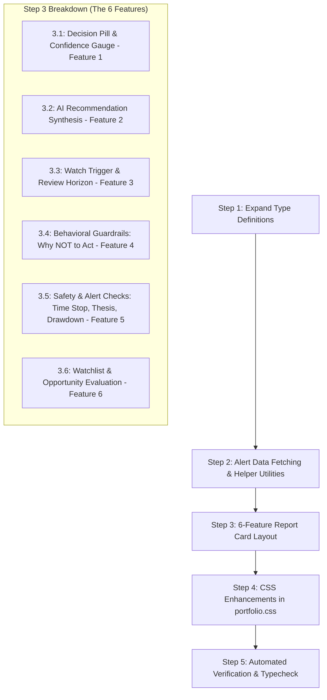

# Plan: Upgrade Smart Advisor — Complete 6-Feature Educational Desk

---

## 1. Context & Goal

Just like the Comparison Judge, the backend computes rich structured recommendations and safety alerts (`Time Stop`, `Thesis Invalidation`, `Drawdown Checks`, `Watch Triggers`, and `Do Not Act Reasons`), but the per-entity Smart Advisor panel in `AiBotWorkspace.tsx` currently only renders a single raw paragraph of text.

**The Goal:** Transform the per-entity Smart Advisor `<article className="ai-bot-panel ai-bot-advice-panel">` inside `src/components/AiBotWorkspace.tsx` into an **educational report card** that teaches the user:
1. *What the recommendation decision means* (`consider_entry`, `consider_rotation`, `watch_and_wait`, `hold`).
2. *Why it was chosen* (grounded evidence & risk points).
3. *What concrete condition triggers action* (`watch_trigger`).
4. *What behavioral guardrails are active* (`do_not_act_reasons`).
5. *The real-time safety status of the holding* (Time Stop stagnation, Thesis integrity, Drawdown).
6. *Contextual intelligence for unheld / watchlist assets*.

**No backend changes required.** All endpoints (`/api/advisor/recommendations`, `/api/alerts/summary`, `/api/advisor/opportunities`) already exist and return this data.

---

## 2. Architecture & Flow Diagram



---

## 3. The 6 Analytical Features to Surface

### Feature 1 — Action Decision Pill & Confidence Gauge
- **What it is:** The primary actionable guidance from the 4-state vocabulary:
  - `Consider Entry` — Strong unheld candidate with peer outperformance.
  - `Consider Rotation` — Held asset consistently underperforming alternatives.
  - `Watch and Wait` — Signal ambiguity or pending data warrants waiting.
  - `Hold` — Healthy position meeting thesis expectations.
- **Confidence Rating:** Numerical score ($0\text{--}100\%$) indicating data grounding and statistical conviction.
- **Educational Caption:** *"Action recommendation synthesized from relative peer performance, chart evidence, and portfolio risk tolerance."*

### Feature 2 — Recommendation Core Synthesis
- **What it is:** The AI-generated advisory narrative explaining the core thesis for the selected asset, with model name and generation timestamp.

### Feature 3 — Watch Trigger & Review Horizon
- **What it is:** A concrete, checkable market condition that must be met before taking action (e.g. *"If 1-year return gap widens past -4.0 pp or price breaks below support"*).
- **Review Horizon:** Days until next formal review (e.g. *"Next review in 14 days"*).
- **Educational Caption:** *"Concrete threshold that must trigger before adjusting position size or exiting."*

### Feature 4 — Behavioral Guardrails ("Reasons NOT to Act Yet")
- **What it is:** Explicit reasons grounding patience and preventing panic selling or FOMO buying (e.g., sample size limitations, pending catalyst, cyclical sector pattern).
- **Educational Caption:** *"Risk guardrails designed to prevent impulsive trades before signal confirmation."*

### Feature 5 — Automated Safety & Regulatory Checks
- **Time Stop Stagnation:** Flags if a holding has stayed dead/non-performing beyond its expected thesis horizon (`✅ Active Momentum` vs `⏱️ Stagnant: N days without progress`).
- **Thesis Invalidation:** Flags if the asset's original thesis has deteriorated (`✅ Thesis Intact` vs `⚠️ Signal Degraded`).
- **Drawdown Alert:** Real-time peak-to-trough drawdown check (`📉 X% Drawdown`).
- **Educational Caption:** *"Automated risk monitors evaluated on every pipeline cycle to protect capital."*

### Feature 6 — Watchlist & Opportunity Guidance (for Unheld Entities)
- **What it is:** For unheld entities, provides clear thesis cards:
  - **Strong Signal:** Surfaced as `💡 Opportunity Candidate` with sector rebalancing gap details.
  - **Mixed / Weak / Insufficient Data:** Contextual explanations of why the watchlist asset is not currently recommended for entry.

---

## 4. The 5-Step Implementation Breakdown

### Step 1: Expand TypeScript Data Models in `AiBotWorkspace.tsx`
Replace the narrow `Recommendation` type with full typed interfaces:

```ts
export type StructuredRecommendation = {
  decision: "consider_entry" | "consider_rotation" | "watch_and_wait" | "hold";
  confidence: number;
  summary: string;
  evidence: string[];
  risks: string[];
  next_review_days: number;
  watch_trigger: string;
  do_not_act_reasons: string[];
};

export type Recommendation = {
  ticker: string;
  recommendation_text: string;
  model_used: string;
  generated_at: string;
  structured?: StructuredRecommendation | null;
};

export type TimeStopAlert = {
  watchlist_id?: number;
  ticker: string;
  is_stagnant: boolean;
  days_in_current_state: number;
  threshold_days: number;
  message?: string;
};

export type ThesisAlert = {
  watchlist_id?: number;
  ticker: string;
  has_reversal: boolean;
  prior_signal?: string;
  current_signal?: string;
  message?: string;
};

export type DrawdownAlert = {
  current_drawdown_percent: number;
  drawdown_percent?: number;
  peak_value?: number;
  current_value?: number;
  is_elevated?: boolean;
};

export type AlertsSummary = {
  timeStops: TimeStopAlert[];
  theses: ThesisAlert[];
  drawdown: DrawdownAlert | null;
};
```

---

### Step 2: Fetch Alert Context & Add Formatting Helpers

1. **Add Alerts Fetching to `AiBotWorkspace.tsx`:**
   In the main `Promise.all` block, fetch `/api/alerts/summary${suffix}`:
   ```ts
   const [..., alertsData] = await Promise.all([
     ...,
     json<AlertsSummary>(`/api/alerts/summary${suffix}`).catch(() => ({ timeStops: [], theses: [], drawdown: null }))
   ]);
   ```

2. **Add Pure Formatting Helpers:**
   ```ts
   function getDecisionMeta(decision?: string): { label: string; className: string } {
     switch (decision) {
       case 'consider_entry': return { label: 'Consider Entry', className: 'ai-bot-decision-entry' };
       case 'consider_rotation': return { label: 'Consider Rotation', className: 'ai-bot-decision-rotation' };
       case 'watch_and_wait': return { label: 'Watch & Wait', className: 'ai-bot-decision-watch' };
       case 'hold': return { label: 'Hold', className: 'ai-bot-decision-hold' };
       default: return { label: decision ? decision.replace(/_/g, ' ') : 'Hold', className: 'ai-bot-decision-hold' };
     }
   }
   ```

---

### Step 3: Implement the 6-Feature Educational Layout

Replace lines inside `<article className="ai-bot-panel ai-bot-advice-panel">` with structured sub-sections:

#### 3.1: Decision Pill & Confidence Gauge (Feature 1)
- Action decision pill (`Consider Entry`, `Consider Rotation`, `Watch & Wait`, `Hold`).
- Numerical confidence badge (`85% Confidence`).
- Explanatory caption on decision synthesis.

#### 3.2: Core Advisory Synthesis & Evidence / Risk Bullets (Feature 2)
- Clean primary narrative text from Gemini.
- Bulleted evidence points (data facts) and risk factors.

#### 3.3: Watch Trigger & Next Review Horizon (Feature 3)
- Concrete market trigger box (`watch_trigger`).
- Target days countdown (`next_review_days`).

#### 3.4: Behavioral Guardrails ("Why NOT to Act Yet") (Feature 4)
- 1–3 explicit reasons preventing impulsive trades before confirmation.

#### 3.5: Automated Safety & Regulatory Checks (Feature 5)
- Grid containing:
  - **Time Stop Stagnation** status.
  - **Thesis Integrity** status.
  - **Drawdown Risk** status.

#### 3.6: Watchlist & Opportunity Candidate Hub (Feature 6)
- Conditional display for unheld assets (`Strong` candidate vs `Mixed`/`Weak`/`Insufficient Data`).

---

### Step 4: CSS Enhancements in `src/portfolio.css`

Add dark-theme styles for the Smart Advisor report card:

```css
/* Smart Advisor Educational Desk */
.ai-bot-advice-report-card {
  display: flex;
  flex-direction: column;
  gap: 16px;
}

.ai-bot-advice-section {
  padding-bottom: 14px;
  border-bottom: 1px solid rgba(255, 255, 255, 0.08);
}

.ai-bot-advice-section:last-child {
  border-bottom: none;
  padding-bottom: 0;
}

.ai-bot-decision-row {
  display: flex;
  align-items: center;
  flex-wrap: wrap;
  gap: 10px;
  margin: 12px 0 8px;
}

.ai-bot-decision-entry {
  background: rgba(85, 209, 155, 0.16);
  color: #62d9a4;
  border: 1px solid rgba(85, 209, 155, 0.35);
}

.ai-bot-decision-rotation {
  background: rgba(224, 110, 70, 0.16);
  color: #f09060;
  border: 1px solid rgba(224, 110, 70, 0.35);
}

.ai-bot-decision-watch {
  background: rgba(217, 154, 43, 0.16);
  color: #e7b85b;
  border: 1px solid rgba(217, 154, 43, 0.35);
}

.ai-bot-safety-grid {
  display: grid;
  grid-template-columns: repeat(auto-fit, minmax(140px, 1fr));
  gap: 8px;
  margin-top: 8px;
}

.ai-bot-safety-card {
  padding: 8px 10px;
  border-radius: 6px;
  background: rgba(255, 255, 255, 0.03);
  border: 1px solid var(--edge);
}

.ai-bot-safety-card span {
  display: block;
  font-size: 10px;
  color: var(--dim);
  text-transform: uppercase;
  letter-spacing: 0.04em;
}

.ai-bot-safety-card strong {
  display: block;
  margin-top: 3px;
  font-size: 11px;
  color: var(--ink);
}

.ai-bot-guardrail-box {
  padding: 10px 12px;
  border-radius: 8px;
  background: rgba(100, 150, 180, 0.08);
  border: 1px solid rgba(100, 150, 180, 0.25);
  margin-top: 10px;
}

.ai-bot-guardrail-box strong {
  display: block;
  font-size: 11px;
  color: #8bb5d6;
  margin-bottom: 4px;
}

.ai-bot-guardrail-list {
  margin: 0;
  padding-left: 16px;
  color: #a8c5be;
  font-size: 11px;
  line-height: 1.5;
}
```

---

### Step 5: Verification & Quality Assurance

1. **TypeScript Typecheck:** Run `npm run typecheck` to guarantee zero errors across all interfaces and components.
2. **Production Build:** Run `npm run build` to confirm clean minification and asset bundling.
3. **Scenario Testing:**
   - Held position with active recommendation (check decision pill, trigger, guardrails, and safety checks).
   - Held position with triggered Time Stop stagnation or Thesis invalidation alert.
   - Unheld candidate with Strong signal (check Opportunity Candidate badge and sector gap details).
   - Unheld asset with Mixed/Weak signal (check contextual watchlist guidance).

