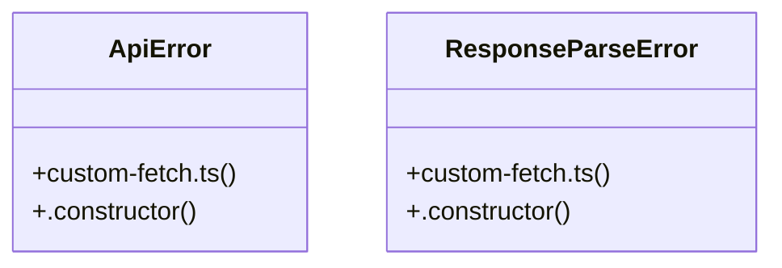

# Community 5

> 59 nodes · cohesion 0.06

## Key Concepts

- [custom-fetch.ts](file:///G:/AI/portofolio-dashbaord/lib/api-client-react/src/custom-fetch.ts#L1) (28 connections)
- [api.ts](file:///G:/AI/portofolio-dashbaord/lib/api-client-react/src/generated/api.ts#L1) (27 connections)
- [customFetch()](file:///G:/AI/portofolio-dashbaord/lib/api-client-react/src/custom-fetch.ts#L325) (16 connections)
- [parseErrorBody()](file:///G:/AI/portofolio-dashbaord/lib/api-client-react/src/custom-fetch.ts#L254) (8 connections)
- [inferResponseType()](file:///G:/AI/portofolio-dashbaord/lib/api-client-react/src/custom-fetch.ts#L285) (5 connections)
- [parseSuccessBody()](file:///G:/AI/portofolio-dashbaord/lib/api-client-react/src/custom-fetch.ts#L293) (5 connections)
- [applyBaseUrl()](file:///G:/AI/portofolio-dashbaord/lib/api-client-react/src/custom-fetch.ts#L63) (4 connections)
- [buildErrorMessage()](file:///G:/AI/portofolio-dashbaord/lib/api-client-react/src/custom-fetch.ts#L151) (4 connections)
- [resolveUrl()](file:///G:/AI/portofolio-dashbaord/lib/api-client-react/src/custom-fetch.ts#L75) (4 connections)
- [createGoldTransaction()](file:///G:/AI/portofolio-dashbaord/lib/api-client-react/src/generated/api.ts#L301) (3 connections)
- [createGrowthSnapshot()](file:///G:/AI/portofolio-dashbaord/lib/api-client-react/src/generated/api.ts#L444) (3 connections)
- [getGetPortfolioQueryKey()](file:///G:/AI/portofolio-dashbaord/lib/api-client-react/src/generated/api.ts#L166) (3 connections)
- [getGetPortfolioQueryOptions()](file:///G:/AI/portofolio-dashbaord/lib/api-client-react/src/generated/api.ts#L173) (3 connections)
- [getHealthCheckQueryOptions()](file:///G:/AI/portofolio-dashbaord/lib/api-client-react/src/generated/api.ts#L95) (3 connections)
- [getPortfolio()](file:///G:/AI/portofolio-dashbaord/lib/api-client-react/src/generated/api.ts#L151) (3 connections)
- [healthCheck()](file:///G:/AI/portofolio-dashbaord/lib/api-client-react/src/generated/api.ts#L73) (3 connections)
- [updateFund()](file:///G:/AI/portofolio-dashbaord/lib/api-client-react/src/generated/api.ts#L372) (3 connections)
- [updateGoldSettings()](file:///G:/AI/portofolio-dashbaord/lib/api-client-react/src/generated/api.ts#L229) (3 connections)
- [useGetPortfolio()](file:///G:/AI/portofolio-dashbaord/lib/api-client-react/src/generated/api.ts#L199) (3 connections)
- [useHealthCheck()](file:///G:/AI/portofolio-dashbaord/lib/api-client-react/src/generated/api.ts#L121) (3 connections)
- [withQueryKey()](file:///G:/AI/portofolio-dashbaord/lib/api-client-react/src/generated/api.ts#L46) (3 connections)
- [getMediaType()](file:///G:/AI/portofolio-dashbaord/lib/api-client-react/src/custom-fetch.ts#L94) (3 connections)
- [hasNoBody()](file:///G:/AI/portofolio-dashbaord/lib/api-client-react/src/custom-fetch.ts#L120) (3 connections)
- [isJsonMediaType()](file:///G:/AI/portofolio-dashbaord/lib/api-client-react/src/custom-fetch.ts#L99) (3 connections)
- [isRequest()](file:///G:/AI/portofolio-dashbaord/lib/api-client-react/src/custom-fetch.ts#L47) (3 connections)
- *... and 34 more nodes in this community*

## Class Diagram

## Relationships

- No strong cross-community connections detected

## Source Files

- [G:\AI\portofolio-dashbaord\lib\api-client-react\src\custom-fetch.ts](file:///G:/AI/portofolio-dashbaord/lib/api-client-react/src/custom-fetch.ts)
- [G:\AI\portofolio-dashbaord\lib\api-client-react\src\generated\api.ts](file:///G:/AI/portofolio-dashbaord/lib/api-client-react/src/generated/api.ts)

## Audit Trail

- EXTRACTED: 204 (94%)
- INFERRED: 13 (6%)
- AMBIGUOUS: 0 (0%)

---

*Part of the graphify knowledge wiki. See [[index]] to navigate.*