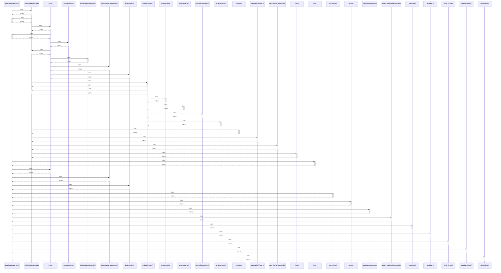

# buildDashboardHtml()

> God node · 15 connections · [G:\AI\portofolio-dashbaord\artifacts\portfolio\src\lib\dashboardHtml.ts](file:///G:/AI/portofolio-dashbaord/artifacts/portfolio/src/lib/dashboardHtml.ts#L510)

## Call Trace Diagram

## Connections by Relation

### calls
- [[buildUsdRealityCard()]] `EXTRACTED`
- [[fmt()]] `INFERRED`
- [[fmt2()]] `INFERRED`
- [[buildGoldCohortAnalysis()]] `EXTRACTED`
- [[buildInsights()]] `EXTRACTED`
- [[signedFmt()]] `EXTRACTED`
- [[pctStr()]] `EXTRACTED`
- [[buildCohortAnalysis()]] `EXTRACTED`
- [[buildAnnualizedReturnCard()]] `EXTRACTED`
- [[heatColor()]] `EXTRACTED`
- [[attribBar()]] `EXTRACTED`
- [[healthGrade()]] `EXTRACTED`
- [[buildDonutRing()]] `EXTRACTED`
- [[allocInsight()]] `EXTRACTED`

### contains
- [[dashboardHtml.ts]] `EXTRACTED`

---

*Part of the graphify knowledge wiki. See [[index]] to navigate.*