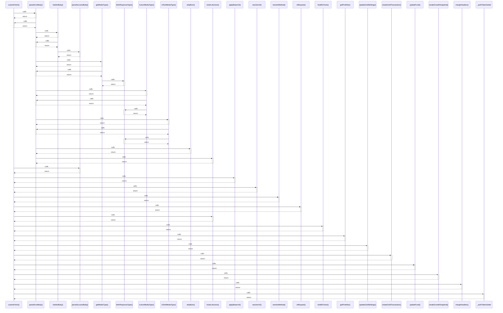

# customFetch()

> God node · 16 connections · [G:\AI\portofolio-dashbaord\lib\api-client-react\src\custom-fetch.ts](file:///G:/AI/portofolio-dashbaord/lib/api-client-react/src/custom-fetch.ts#L325)

## Call Trace Diagram

## Connections by Relation

### calls
- [[parseErrorBody()]] `EXTRACTED`
- [[parseSuccessBody()]] `EXTRACTED`
- [[applyBaseUrl()]] `EXTRACTED`
- [[resolveUrl()]] `EXTRACTED`
- [[resolveMethod()]] `EXTRACTED`
- [[isRequest()]] `EXTRACTED`
- [[looksLikeJson()]] `EXTRACTED`
- [[healthCheck()]] `INFERRED`
- [[getPortfolio()]] `INFERRED`
- [[updateGoldSettings()]] `INFERRED`
- [[createGoldTransaction()]] `INFERRED`
- [[updateFund()]] `INFERRED`
- [[createGrowthSnapshot()]] `INFERRED`
- [[mergeHeaders()]] `EXTRACTED`
- [[_authTokenGetter]] `EXTRACTED`

### contains
- [[custom-fetch.ts]] `EXTRACTED`

---

*Part of the graphify knowledge wiki. See [[index]] to navigate.*