# fetchOverview()

> God node · 13 connections · [G:\AI\portofolio-dashbaord\artifacts\api-server\src\scraper\parseStockAnalysis.ts](file:///G:/AI/portofolio-dashbaord/artifacts/api-server/src/scraper/parseStockAnalysis.ts#L296)

## Call Trace Diagram

```mermaid
sequenceDiagram
    participant P0 as fetchOverview()
    participant P1 as match
    participant P2 as tryPlainFetch()
    participant P3 as parseStockPage()
    participant P4 as extractSignal()
    participant P5 as extractPeRatio()
    participant P6 as extractDividendYield()
    participant P7 as extractMarketCap()
    participant P8 as extractSectorRank()
    participant P9 as emptySnapshot()
    participant P10 as tryPlainFetch()
    participant P11 as parseStockPage()
    participant P12 as extractSignal()
    participant P13 as extractPeRatio()
    participant P14 as extractDividendYield()
    participant P15 as extractMarketCap()
    participant P16 as extractSectorRank()
    participant P17 as emptySnapshot()
    participant P18 as tryPlainFetch()
    participant P19 as tryOptimizedBrowser()
    participant P20 as tryOptimizedBrowser()
    participant P21 as tryOptimizedBrowser()
    participant P22 as extractLabeled()
    participant P23 as extractChartReferencePrice()
    participant P24 as parseSuffixedNumber()
    participant P25 as extractPercentageAfter()
    participant P26 as parseWeek52Range()
    participant P27 as extractSignal()
    participant P28 as extractPeRatio()
    participant P29 as extractDividendYield()
    participant P30 as extractMarketCap()
    participant P31 as extractSectorRank()
    participant P32 as extractPercentNear()
    participant P33 as extractCagr()
    participant P34 as extractPriceNear()
    participant P35 as extractScoreNear()
    participant P36 as extractPointsNear()
    participant P37 as extractChangePercentNear()
    participant P38 as extractYtdPercentNear()
    participant P39 as extract1yPercentNear()
    participant P40 as extractPeRatio()
    participant P41 as extractPercentNear()
    participant P42 as extractCagr()
    participant P43 as extractPriceNear()
    participant P44 as extractScoreNear()
    participant P45 as extractPercentNear()
    participant P46 as extractCagr()
    participant P47 as extractPriceNear()
    participant P48 as extractScoreNear()
    participant P49 as extractPointsNear()
    participant P50 as extractChangePercentNear()
    participant P51 as extractPointsNear()
    participant P52 as extractChangePercentNear()
    participant P53 as importedUnitsFromMeta()
    participant P54 as fetchSixtySessionMove()
    participant P55 as parsePlainNumber()
    participant P56 as parseStockAnalysis()
    participant P57 as extractLabeledAny()
    participant P58 as parsePercent()
    participant P59 as percentageChange()
    P0->>+ P1: calls
    P1-->>- P0: return
    P1->>+ P0: calls
    P0-->>- P1: return
    P1->>+ P2: calls
    P2-->>- P1: return
    P2->>+ P1: calls
    P1-->>- P2: return
    P2->>+ P3: calls
    P3-->>- P2: return
    P2->>+ P4: calls
    P4-->>- P2: return
    P2->>+ P5: calls
    P5-->>- P2: return
    P2->>+ P6: calls
    P6-->>- P2: return
    P2->>+ P7: calls
    P7-->>- P2: return
    P2->>+ P8: calls
    P8-->>- P2: return
    P2->>+ P9: calls
    P9-->>- P2: return
    P1->>+ P10: calls
    P10-->>- P1: return
    P10->>+ P1: calls
    P1-->>- P10: return
    P10->>+ P11: calls
    P11-->>- P10: return
    P10->>+ P12: calls
    P12-->>- P10: return
    P10->>+ P13: calls
    P13-->>- P10: return
    P10->>+ P14: calls
    P14-->>- P10: return
    P10->>+ P15: calls
    P15-->>- P10: return
    P10->>+ P16: calls
    P16-->>- P10: return
    P10->>+ P17: calls
    P17-->>- P10: return
    P1->>+ P18: calls
    P18-->>- P1: return
    P1->>+ P19: calls
    P19-->>- P1: return
    P1->>+ P20: calls
    P20-->>- P1: return
    P1->>+ P21: calls
    P21-->>- P1: return
    P1->>+ P22: calls
    P22-->>- P1: return
    P1->>+ P4: calls
    P4-->>- P1: return
    P1->>+ P5: calls
    P5-->>- P1: return
    P1->>+ P6: calls
    P6-->>- P1: return
    P1->>+ P7: calls
    P7-->>- P1: return
    P1->>+ P8: calls
    P8-->>- P1: return
    P1->>+ P23: calls
    P23-->>- P1: return
    P1->>+ P24: calls
    P24-->>- P1: return
    P1->>+ P25: calls
    P25-->>- P1: return
    P1->>+ P26: calls
    P26-->>- P1: return
    P1->>+ P12: calls
    P12-->>- P1: return
    P1->>+ P13: calls
    P13-->>- P1: return
    P1->>+ P14: calls
    P14-->>- P1: return
    P1->>+ P15: calls
    P15-->>- P1: return
    P1->>+ P16: calls
    P16-->>- P1: return
    P1->>+ P27: calls
    P27-->>- P1: return
    P1->>+ P28: calls
    P28-->>- P1: return
    P1->>+ P29: calls
    P29-->>- P1: return
    P1->>+ P30: calls
    P30-->>- P1: return
    P1->>+ P31: calls
    P31-->>- P1: return
    P1->>+ P32: calls
    P32-->>- P1: return
    P1->>+ P33: calls
    P33-->>- P1: return
    P1->>+ P34: calls
    P34-->>- P1: return
    P1->>+ P35: calls
    P35-->>- P1: return
    P1->>+ P36: calls
    P36-->>- P1: return
    P1->>+ P37: calls
    P37-->>- P1: return
    P1->>+ P38: calls
    P38-->>- P1: return
    P1->>+ P39: calls
    P39-->>- P1: return
    P1->>+ P40: calls
    P40-->>- P1: return
    P1->>+ P41: calls
    P41-->>- P1: return
    P1->>+ P42: calls
    P42-->>- P1: return
    P1->>+ P43: calls
    P43-->>- P1: return
    P1->>+ P44: calls
    P44-->>- P1: return
    P1->>+ P45: calls
    P45-->>- P1: return
    P1->>+ P46: calls
    P46-->>- P1: return
    P1->>+ P47: calls
    P47-->>- P1: return
    P1->>+ P48: calls
    P48-->>- P1: return
    P1->>+ P49: calls
    P49-->>- P1: return
    P1->>+ P50: calls
    P50-->>- P1: return
    P1->>+ P51: calls
    P51-->>- P1: return
    P1->>+ P52: calls
    P52-->>- P1: return
    P1->>+ P53: calls
    P53-->>- P1: return
    P1->>+ P54: calls
    P54-->>- P1: return
    P0->>+ P55: calls
    P55-->>- P0: return
    P0->>+ P22: calls
    P22-->>- P0: return
    P0->>+ P56: calls
    P56-->>- P0: return
    P0->>+ P23: calls
    P23-->>- P0: return
    P0->>+ P24: calls
    P24-->>- P0: return
    P0->>+ P25: calls
    P25-->>- P0: return
    P0->>+ P57: calls
    P57-->>- P0: return
    P0->>+ P26: calls
    P26-->>- P0: return
    P0->>+ P58: calls
    P58-->>- P0: return
    P0->>+ P59: calls
    P59-->>- P0: return
    P0->>+ P40: calls
    P40-->>- P0: return
```

## Connections by Relation

### calls
- [[match]] `INFERRED`
- [[parsePlainNumber()]] `EXTRACTED`
- [[extractLabeled()]] `EXTRACTED`
- [[parseStockAnalysis()]] `EXTRACTED`
- [[extractChartReferencePrice()]] `EXTRACTED`
- [[parseSuffixedNumber()]] `EXTRACTED`
- [[extractPercentageAfter()]] `EXTRACTED`
- [[extractLabeledAny()]] `EXTRACTED`
- [[parseWeek52Range()]] `EXTRACTED`
- [[parsePercent()]] `EXTRACTED`
- [[percentageChange()]] `EXTRACTED`
- [[extractPeRatio()]] `EXTRACTED`

### contains
- [[parseStockAnalysis.ts]] `EXTRACTED`

---

*Part of the graphify knowledge wiki. See [[index]] to navigate.*