# Knowledge Graph Index

> Auto-generated by graphify. Start here — read community articles for context, then drill into god nodes for detail.

**1295 nodes · 1637 edges · 158 communities**

---

## System Architecture Flowchart

```mermaid
flowchart TD
    C0["Community 0 (96 nodes)"]
    C1["Community 1 (76 nodes)"]
    C2["Community 2 (64 nodes)"]
    C3["Community 3 (64 nodes)"]
    C4["Community 4 (59 nodes)"]
    C5["Community 5 (54 nodes)"]
    C6["Community 6 (51 nodes)"]
    C7["Community 7 (43 nodes)"]
    C8["Community 8 (40 nodes)"]
    C9["Community 9 (30 nodes)"]
    C10["Community 10 (28 nodes)"]
    C11["Community 11 (28 nodes)"]
    C12["Community 12 (20 nodes)"]
    C13["Community 13 (18 nodes)"]
    C14["Community 14 (17 nodes)"]
    C15["Community 15 (16 nodes)"]
    C16["Community 16 (15 nodes)"]
    C17["Community 17 (15 nodes)"]
    C18["Community 18 (15 nodes)"]
    C19["Community 19 (14 nodes)"]
    C20["Community 20 (13 nodes)"]
    C21["Selection UI (12 nodes)"]
    C22["Community 22 (12 nodes)"]
    C23["Community 23 (12 nodes)"]
    C24["Community 24 (12 nodes)"]
    C25["Community 25 (11 nodes)"]
    C26["Community 26 (11 nodes)"]
    C27["Drawer Component (10 nodes)"]
    C28["Community 28 (10 nodes)"]
    C29["Community 29 (10 nodes)"]
    C30["Community 30 (10 nodes)"]
    C31["Community 31 (9 nodes)"]
    C32["Contextual Menus (9 nodes)"]
    C33["Dropdown Menu (9 nodes)"]
    C34["Community 34 (9 nodes)"]
    C35["Community 35 (9 nodes)"]
    C36["Community 36 (9 nodes)"]
    C37["Community 37 (9 nodes)"]
    C38["Community 38 (8 nodes)"]
    C39["Card Component (8 nodes)"]
    C40["Community 40 (8 nodes)"]
    C41["Community 41 (7 nodes)"]
    C42["Community 42 (7 nodes)"]
    C43["Accordion component (6 nodes)"]
    C44["Community 44 (6 nodes)"]
    C45["Modal Dialog (6 nodes)"]
    C46["Popover UI (6 nodes)"]
    C47["Sheet UI (6 nodes)"]
    C48["Tooltip UI (6 nodes)"]
    C49["unknown (6 nodes)"]
    C50["Community 50 (6 nodes)"]
    C51["Community 51 (6 nodes)"]
    C52["Community 52 (6 nodes)"]
    C53["Community 53 (5 nodes)"]
    C54["Community 54 (5 nodes)"]
    C55["Server config (5 nodes)"]
    C56["Alert Dialog (5 nodes)"]
    C57["Collapsible UI (5 nodes)"]
    C58["Hover Card (5 nodes)"]
    C59["Community 59 (5 nodes)"]
    C60["Toggle Group Component (5 nodes)"]
    C61["Tab Navigation (5 nodes)"]
    C62["Community 62 (5 nodes)"]
    C63["Application Layer (5 nodes)"]
    C64["Community 64 (4 nodes)"]
    C65["Community 65 (4 nodes)"]
    C66["User Avatar (4 nodes)"]
    C67["Badge System (4 nodes)"]
    C68["Community 68 (4 nodes)"]
    C69["Button styling (4 nodes)"]
    C70["Scrollable UI (4 nodes)"]
    C71["Toggle Component (4 nodes)"]
    C72["Community 72 (4 nodes)"]
    C73["User Notifications (4 nodes)"]
    C74["Navigation UI (4 nodes)"]
    C75["OTP Input Field (4 nodes)"]
    C76["UI Labeling (4 nodes)"]
    C77["Supabase Connection (4 nodes)"]
    C78["Community 78 (4 nodes)"]
    C79["Community 79 (4 nodes)"]
    C80["Community 80 (4 nodes)"]
    C81["Community 81 (3 nodes)"]
    C82["Display Geometry (3 nodes)"]
    C83["Community 83 (3 nodes)"]
    C84["Community 84 (3 nodes)"]
    C85["Community 85 (3 nodes)"]
    C86["Community 86 (3 nodes)"]
    C87["Interactive Controls (3 nodes)"]
    C88["Community 88 (3 nodes)"]
    C89["Database Table (3 nodes)"]
    C90["Notification System (3 nodes)"]
    C91["Toast Notification (3 nodes)"]
    C92["Community 92 (3 nodes)"]
    C93["Selection Controls (3 nodes)"]
    C94["unknown (3 nodes)"]
    C95["Community 95 (3 nodes)"]
    C96["Network Routing (2 nodes)"]
    C97["Community 97 (2 nodes)"]
    C98["unknown (2 nodes)"]
    C99["Query Management (2 nodes)"]
    C100["Form Controls (2 nodes)"]
    C101["Progress Tracking (2 nodes)"]
    C102["File Path (2 nodes)"]
    C103["unknown (2 nodes)"]
    C104["Network Switch (2 nodes)"]
    C105["Form Input (2 nodes)"]
    C106["unknown (2 nodes)"]
    C107["Community 107 (2 nodes)"]
    C108["Community 108 (2 nodes)"]
    C109["Community 109 (2 nodes)"]
    C110["Community 110 (2 nodes)"]
    C111["unknown (2 nodes)"]
    C112["unknown (2 nodes)"]
    C113["unknown (2 nodes)"]
    C114["unknown (1 nodes)"]
    C115["unknown (1 nodes)"]
    C116["unknown (1 nodes)"]
    C117["unknown (1 nodes)"]
    C118["unknown (1 nodes)"]
    C119["unknown (1 nodes)"]
    C120["unknown (1 nodes)"]
    C121["unknown (1 nodes)"]
    C122["unknown (1 nodes)"]
    C123["unknown (1 nodes)"]
    C124["unknown (1 nodes)"]
    C125["unknown (1 nodes)"]
    C126["unknown (1 nodes)"]
    C127["unknown (1 nodes)"]
    C128["unknown (1 nodes)"]
    C129["unknown (1 nodes)"]
    C130["unknown (1 nodes)"]
    C131["unknown (1 nodes)"]
    C132["unknown (1 nodes)"]
    C133["unknown (1 nodes)"]
    C134["unknown (1 nodes)"]
    C135["unknown (1 nodes)"]
    C136["unknown (1 nodes)"]
    C137["unknown (1 nodes)"]
    C138["unknown (1 nodes)"]
    C139["unknown (1 nodes)"]
    C140["unknown (1 nodes)"]
    C141["unknown (1 nodes)"]
    C142["unknown (1 nodes)"]
    C143["unknown (1 nodes)"]
    C144["unknown (1 nodes)"]
    C145["unknown (1 nodes)"]
    C146["unknown (1 nodes)"]
    C147["unknown (1 nodes)"]
    C148["unknown (1 nodes)"]
    C149["unknown (1 nodes)"]
    C150["unknown (1 nodes)"]
    C151["unknown (1 nodes)"]
    C152["unknown (1 nodes)"]
    C153["unknown (1 nodes)"]
    C154["unknown (1 nodes)"]
    C155["unknown (1 nodes)"]
    C156["unknown (1 nodes)"]
    C157["unknown (1 nodes)"]
    C1 -->|8 edges| C11
    C14 -->|7 edges| C1
    C2 -->|3 edges| C11
    C5 -->|2 edges| C2
    C1 -->|2 edges| C21
    C6 -->|2 edges| C10
    C10 -->|1 edges| C6
    C8 -->|1 edges| C6
    C10 -->|1 edges| C5
    C8 -->|1 edges| C5
    C21 -->|1 edges| C2
    C5 -->|1 edges| C6
    C0 -->|1 edges| C26
    C0 -->|1 edges| C1
    C32 -->|1 edges| C1
    C13 -->|1 edges| C6
    C13 -->|1 edges| C4
    C3 -->|1 edges| C6
```

## Communities
(sorted by size, largest first)

- [[Community 0]] — 96 nodes
- [[Community 1]] — 76 nodes
- [[Community 2]] — 64 nodes
- [[Community 3]] — 64 nodes
- [[Community 4]] — 59 nodes
- [[Community 5]] — 54 nodes
- [[Community 6]] — 51 nodes
- [[Community 7]] — 43 nodes
- [[Community 8]] — 40 nodes
- [[Community 9]] — 30 nodes
- [[Community 10]] — 28 nodes
- [[Community 11]] — 28 nodes
- [[Community 12]] — 20 nodes
- [[Community 13]] — 18 nodes
- [[Community 14]] — 17 nodes
- [[Community 15]] — 16 nodes
- [[Community 16]] — 15 nodes
- [[Community 17]] — 15 nodes
- [[Community 18]] — 15 nodes
- [[Community 19]] — 14 nodes
- [[Community 20]] — 13 nodes
- [[Selection UI]] — 12 nodes
- [[Community 22]] — 12 nodes
- [[Community 23]] — 12 nodes
- [[Community 24]] — 12 nodes
- [[Community 25]] — 11 nodes
- [[Community 26]] — 11 nodes
- [[Drawer Component]] — 10 nodes
- [[Community 28]] — 10 nodes
- [[Community 29]] — 10 nodes
- [[Community 30]] — 10 nodes
- [[Community 31]] — 9 nodes
- [[Contextual Menus]] — 9 nodes
- [[Dropdown Menu]] — 9 nodes
- [[Community 34]] — 9 nodes
- [[Community 35]] — 9 nodes
- [[Community 36]] — 9 nodes
- [[Community 37]] — 9 nodes
- [[Community 38]] — 8 nodes
- [[Card Component]] — 8 nodes
- [[Community 40]] — 8 nodes
- [[Community 41]] — 7 nodes
- [[Community 42]] — 7 nodes
- [[Accordion component]] — 6 nodes
- [[Community 44]] — 6 nodes
- [[Modal Dialog]] — 6 nodes
- [[Popover UI]] — 6 nodes
- [[Sheet UI]] — 6 nodes
- [[Tooltip UI]] — 6 nodes
- [[unknown]] — 6 nodes
- [[Community 50]] — 6 nodes
- [[Community 51]] — 6 nodes
- [[Community 52]] — 6 nodes
- [[Community 53]] — 5 nodes
- [[Community 54]] — 5 nodes
- [[Server config]] — 5 nodes
- [[Alert Dialog]] — 5 nodes
- [[Collapsible UI]] — 5 nodes
- [[Hover Card]] — 5 nodes
- [[Community 59]] — 5 nodes
- [[Toggle Group Component]] — 5 nodes
- [[Tab Navigation]] — 5 nodes
- [[Community 62]] — 5 nodes
- [[Application Layer]] — 5 nodes
- [[Community 64]] — 4 nodes
- [[Community 65]] — 4 nodes
- [[User Avatar]] — 4 nodes
- [[Badge System]] — 4 nodes
- [[Community 68]] — 4 nodes
- [[Button styling]] — 4 nodes
- [[Scrollable UI]] — 4 nodes
- [[Toggle Component]] — 4 nodes
- [[Community 72]] — 4 nodes
- [[User Notifications]] — 4 nodes
- [[Navigation UI]] — 4 nodes
- [[OTP Input Field]] — 4 nodes
- [[UI Labeling]] — 4 nodes
- [[Supabase Connection]] — 4 nodes
- [[Community 78]] — 4 nodes
- [[Community 79]] — 4 nodes
- [[Community 80]] — 4 nodes
- [[Community 81]] — 3 nodes
- [[Display Geometry]] — 3 nodes
- [[Community 83]] — 3 nodes
- [[Community 84]] — 3 nodes
- [[Community 85]] — 3 nodes
- [[Community 86]] — 3 nodes
- [[Interactive Controls]] — 3 nodes
- [[Community 88]] — 3 nodes
- [[Database Table]] — 3 nodes
- [[Notification System]] — 3 nodes
- [[Toast Notification]] — 3 nodes
- [[Community 92]] — 3 nodes
- [[Selection Controls]] — 3 nodes
- [[unknown]] — 3 nodes
- [[Community 95]] — 3 nodes
- [[Network Routing]] — 2 nodes
- [[Community 97]] — 2 nodes
- [[unknown]] — 2 nodes
- [[Query Management]] — 2 nodes
- [[Form Controls]] — 2 nodes
- [[Progress Tracking]] — 2 nodes
- [[File Path]] — 2 nodes
- [[unknown]] — 2 nodes
- [[Network Switch]] — 2 nodes
- [[Form Input]] — 2 nodes
- [[unknown]] — 2 nodes
- [[Community 107]] — 2 nodes
- [[Community 108]] — 2 nodes
- [[Community 109]] — 2 nodes
- [[Community 110]] — 2 nodes
- [[unknown]] — 2 nodes
- [[unknown]] — 2 nodes
- [[unknown]] — 2 nodes
- [[unknown]] — 1 nodes
- [[unknown]] — 1 nodes
- [[unknown]] — 1 nodes
- [[unknown]] — 1 nodes
- [[unknown]] — 1 nodes
- [[unknown]] — 1 nodes
- [[unknown]] — 1 nodes
- [[unknown]] — 1 nodes
- [[unknown]] — 1 nodes
- [[unknown]] — 1 nodes
- [[unknown]] — 1 nodes
- [[unknown]] — 1 nodes
- [[unknown]] — 1 nodes
- [[unknown]] — 1 nodes
- [[unknown]] — 1 nodes
- [[unknown]] — 1 nodes
- [[unknown]] — 1 nodes
- [[unknown]] — 1 nodes
- [[unknown]] — 1 nodes
- [[unknown]] — 1 nodes
- [[unknown]] — 1 nodes
- [[unknown]] — 1 nodes
- [[unknown]] — 1 nodes
- [[unknown]] — 1 nodes
- [[unknown]] — 1 nodes
- [[unknown]] — 1 nodes
- [[unknown]] — 1 nodes
- [[unknown]] — 1 nodes
- [[unknown]] — 1 nodes
- [[unknown]] — 1 nodes
- [[unknown]] — 1 nodes
- [[unknown]] — 1 nodes
- [[unknown]] — 1 nodes
- [[unknown]] — 1 nodes
- [[unknown]] — 1 nodes
- [[unknown]] — 1 nodes
- [[unknown]] — 1 nodes
- [[unknown]] — 1 nodes
- [[unknown]] — 1 nodes
- [[unknown]] — 1 nodes
- [[unknown]] — 1 nodes
- [[unknown]] — 1 nodes
- [[unknown]] — 1 nodes
- [[unknown]] — 1 nodes

## God Nodes
(most connected concepts — the load-bearing abstractions)

- [[match]] — 51 connections
- [[customFetch()]] — 16 connections
- [[buildDashboardHtml()]] — 15 connections
- [[judgeHolding()]] — 14 connections
- [[query]] — 13 connections
- [[fetchOverview()]] — 13 connections
- [[tryPlainFetch()]] — 9 connections
- [[toLocaleString()]] — 9 connections
- [[judgeHolding()]] — 9 connections
- [[parseFundPage()]] — 9 connections

---

*Generated by [graphify](https://github.com/safishamsi/graphify)*