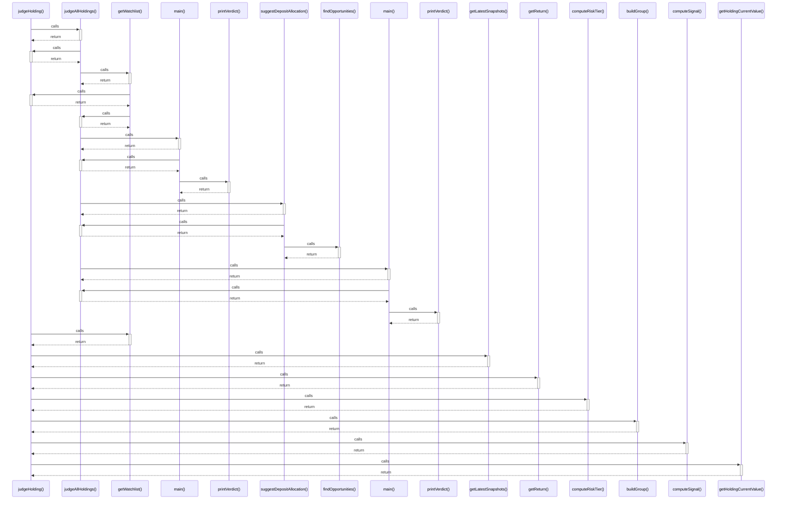

# judgeHolding()

> God node · 9 connections · [G:\AI\portofolio-dashbaord\attached_assets\comparisonJudge_1785632070487.ts](file:///G:/AI/portofolio-dashbaord/attached_assets/comparisonJudge_1785632070487.ts#L725)

## Call Trace Diagram

## Connections by Relation

### calls
- [[judgeAllHoldings()]] `EXTRACTED`
- [[getWatchlist()]] `EXTRACTED`
- [[getLatestSnapshots()]] `EXTRACTED`
- [[getReturn()]] `EXTRACTED`
- [[computeRiskTier()]] `EXTRACTED`
- [[buildGroup()]] `EXTRACTED`
- [[computeSignal()]] `EXTRACTED`
- [[getHoldingCurrentValue()]] `EXTRACTED`

### contains
- [[comparisonJudge_1785632070487.ts]] `EXTRACTED`

---

*Part of the graphify knowledge wiki. See [[index]] to navigate.*