# match

> God node · 51 connections · [G:\AI\portofolio-dashbaord\artifacts\mockup-sandbox\src\App.tsx](file:///G:/AI/portofolio-dashbaord/artifacts/mockup-sandbox/src/App.tsx#L127)

## Call Trace Diagram

```mermaid
sequenceDiagram
    participant P0 as match
    participant P1 as fetchOverview()
    participant P2 as parsePlainNumber()
    participant P3 as fetchStatistics()
    participant P4 as extractChartReferencePrice()
    participant P5 as parseWeek52Range()
    participant P6 as extractLabeled()
    participant P7 as extractLabeledAny()
    participant P8 as parseStockAnalysis()
    participant P9 as fetchHistory()
    participant P10 as emptyFundamentals()
    participant P11 as parseSuffixedNumber()
    participant P12 as extractPercentageAfter()
    participant P13 as parsePercent()
    participant P14 as percentageChange()
    participant P15 as extractPeRatio()
    participant P16 as tryPlainFetch()
    participant P17 as tryPlainFetch()
    participant P18 as tryPlainFetch()
    participant P19 as tryOptimizedBrowser()
    participant P20 as tryOptimizedBrowser()
    participant P21 as tryOptimizedBrowser()
    participant P22 as extractSignal()
    participant P23 as extractPeRatio()
    participant P24 as extractDividendYield()
    participant P25 as extractMarketCap()
    participant P26 as extractSectorRank()
    participant P27 as extractSignal()
    participant P28 as extractPeRatio()
    participant P29 as extractDividendYield()
    participant P30 as extractMarketCap()
    participant P31 as extractSectorRank()
    participant P32 as extractSignal()
    participant P33 as extractPeRatio()
    participant P34 as extractDividendYield()
    participant P35 as extractMarketCap()
    participant P36 as extractSectorRank()
    participant P37 as extractPercentNear()
    participant P38 as extractCagr()
    participant P39 as extractPriceNear()
    participant P40 as extractScoreNear()
    participant P41 as extractPointsNear()
    participant P42 as extractChangePercentNear()
    participant P43 as extractYtdPercentNear()
    participant P44 as extract1yPercentNear()
    participant P45 as extractPercentNear()
    participant P46 as extractCagr()
    participant P47 as extractPriceNear()
    participant P48 as extractScoreNear()
    participant P49 as extractPercentNear()
    participant P50 as extractCagr()
    participant P51 as extractPriceNear()
    participant P52 as extractScoreNear()
    participant P53 as extractPointsNear()
    participant P54 as extractChangePercentNear()
    participant P55 as extractPointsNear()
    participant P56 as extractChangePercentNear()
    participant P57 as importedUnitsFromMeta()
    participant P58 as fetchSixtySessionMove()
    P0->>+ P1: calls
    P1-->>- P0: return
    P1->>+ P0: calls
    P0-->>- P1: return
    P1->>+ P2: calls
    P2-->>- P1: return
    P2->>+ P1: calls
    P1-->>- P2: return
    P2->>+ P3: calls
    P3-->>- P2: return
    P2->>+ P4: calls
    P4-->>- P2: return
    P2->>+ P5: calls
    P5-->>- P2: return
    P1->>+ P6: calls
    P6-->>- P1: return
    P6->>+ P0: calls
    P0-->>- P6: return
    P6->>+ P1: calls
    P1-->>- P6: return
    P6->>+ P3: calls
    P3-->>- P6: return
    P6->>+ P7: calls
    P7-->>- P6: return
    P1->>+ P8: calls
    P8-->>- P1: return
    P8->>+ P1: calls
    P1-->>- P8: return
    P8->>+ P3: calls
    P3-->>- P8: return
    P8->>+ P9: calls
    P9-->>- P8: return
    P8->>+ P10: calls
    P10-->>- P8: return
    P1->>+ P4: calls
    P4-->>- P1: return
    P1->>+ P11: calls
    P11-->>- P1: return
    P1->>+ P12: calls
    P12-->>- P1: return
    P1->>+ P7: calls
    P7-->>- P1: return
    P1->>+ P5: calls
    P5-->>- P1: return
    P1->>+ P13: calls
    P13-->>- P1: return
    P1->>+ P14: calls
    P14-->>- P1: return
    P1->>+ P15: calls
    P15-->>- P1: return
    P0->>+ P16: calls
    P16-->>- P0: return
    P0->>+ P17: calls
    P17-->>- P0: return
    P0->>+ P18: calls
    P18-->>- P0: return
    P0->>+ P19: calls
    P19-->>- P0: return
    P0->>+ P20: calls
    P20-->>- P0: return
    P0->>+ P21: calls
    P21-->>- P0: return
    P0->>+ P6: calls
    P6-->>- P0: return
    P0->>+ P22: calls
    P22-->>- P0: return
    P0->>+ P23: calls
    P23-->>- P0: return
    P0->>+ P24: calls
    P24-->>- P0: return
    P0->>+ P25: calls
    P25-->>- P0: return
    P0->>+ P26: calls
    P26-->>- P0: return
    P0->>+ P4: calls
    P4-->>- P0: return
    P0->>+ P11: calls
    P11-->>- P0: return
    P0->>+ P12: calls
    P12-->>- P0: return
    P0->>+ P5: calls
    P5-->>- P0: return
    P0->>+ P27: calls
    P27-->>- P0: return
    P0->>+ P28: calls
    P28-->>- P0: return
    P0->>+ P29: calls
    P29-->>- P0: return
    P0->>+ P30: calls
    P30-->>- P0: return
    P0->>+ P31: calls
    P31-->>- P0: return
    P0->>+ P32: calls
    P32-->>- P0: return
    P0->>+ P33: calls
    P33-->>- P0: return
    P0->>+ P34: calls
    P34-->>- P0: return
    P0->>+ P35: calls
    P35-->>- P0: return
    P0->>+ P36: calls
    P36-->>- P0: return
    P0->>+ P37: calls
    P37-->>- P0: return
    P0->>+ P38: calls
    P38-->>- P0: return
    P0->>+ P39: calls
    P39-->>- P0: return
    P0->>+ P40: calls
    P40-->>- P0: return
    P0->>+ P41: calls
    P41-->>- P0: return
    P0->>+ P42: calls
    P42-->>- P0: return
    P0->>+ P43: calls
    P43-->>- P0: return
    P0->>+ P44: calls
    P44-->>- P0: return
    P0->>+ P15: calls
    P15-->>- P0: return
    P0->>+ P45: calls
    P45-->>- P0: return
    P0->>+ P46: calls
    P46-->>- P0: return
    P0->>+ P47: calls
    P47-->>- P0: return
    P0->>+ P48: calls
    P48-->>- P0: return
    P0->>+ P49: calls
    P49-->>- P0: return
    P0->>+ P50: calls
    P50-->>- P0: return
    P0->>+ P51: calls
    P51-->>- P0: return
    P0->>+ P52: calls
    P52-->>- P0: return
    P0->>+ P53: calls
    P53-->>- P0: return
    P0->>+ P54: calls
    P54-->>- P0: return
    P0->>+ P55: calls
    P55-->>- P0: return
    P0->>+ P56: calls
    P56-->>- P0: return
    P0->>+ P57: calls
    P57-->>- P0: return
    P0->>+ P58: calls
    P58-->>- P0: return
```

## Connections by Relation

### calls
- [[fetchOverview()]] `INFERRED`
- [[tryPlainFetch()]] `INFERRED`
- [[tryPlainFetch()]] `INFERRED`
- [[tryPlainFetch()]] `INFERRED`
- [[tryOptimizedBrowser()]] `INFERRED`
- [[tryOptimizedBrowser()]] `INFERRED`
- [[tryOptimizedBrowser()]] `INFERRED`
- [[extractLabeled()]] `INFERRED`
- [[extractSignal()]] `INFERRED`
- [[extractPeRatio()]] `INFERRED`
- [[extractDividendYield()]] `INFERRED`
- [[extractMarketCap()]] `INFERRED`
- [[extractSectorRank()]] `INFERRED`
- [[extractChartReferencePrice()]] `INFERRED`
- [[parseSuffixedNumber()]] `INFERRED`
- [[extractPercentageAfter()]] `INFERRED`
- [[parseWeek52Range()]] `INFERRED`
- [[extractSignal()]] `INFERRED`
- [[extractPeRatio()]] `INFERRED`
- [[extractDividendYield()]] `INFERRED`

### contains
- [[App.tsx]] `EXTRACTED`

---

*Part of the graphify knowledge wiki. See [[index]] to navigate.*