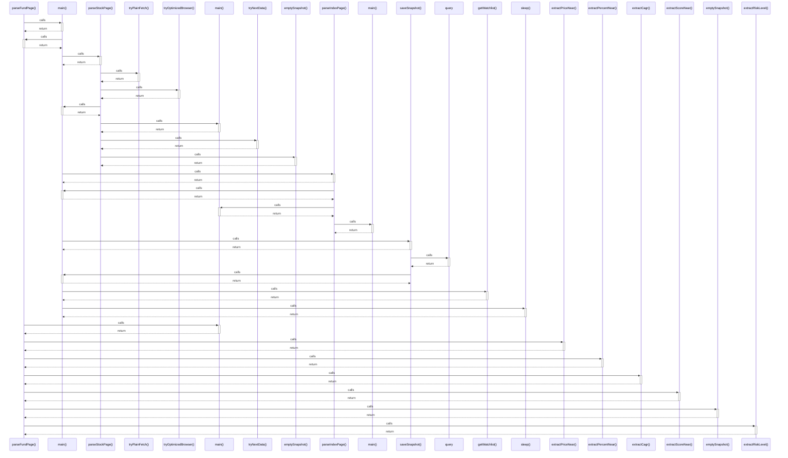

# parseFundPage()

> God node · 9 connections · [G:\AI\portofolio-dashbaord\attached_assets\parseFund_1785599325894.ts](file:///G:/AI/portofolio-dashbaord/attached_assets/parseFund_1785599325894.ts#L90)

## Call Trace Diagram

## Connections by Relation

### calls
- [[main()]] `INFERRED`
- [[main()]] `INFERRED`
- [[extractPriceNear()]] `EXTRACTED`
- [[extractPercentNear()]] `EXTRACTED`
- [[extractCagr()]] `EXTRACTED`
- [[extractScoreNear()]] `EXTRACTED`
- [[emptySnapshot()]] `EXTRACTED`
- [[extractRiskLevel()]] `EXTRACTED`

### contains
- [[parseFund_1785599325894.ts]] `EXTRACTED`

---

*Part of the graphify knowledge wiki. See [[index]] to navigate.*