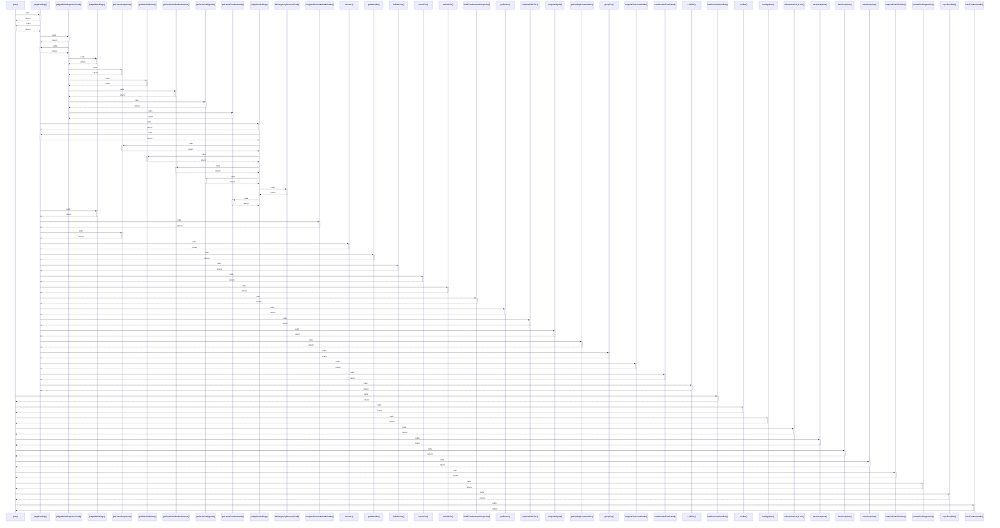

# query

> God node · 13 connections · [G:\AI\portofolio-dashbaord\artifacts\api-server\src\routes\verdicts.ts](file:///G:/AI/portofolio-dashbaord/artifacts/api-server/src/routes/verdicts.ts#L39)

## Call Trace Diagram

## Connections by Relation

### calls
- [[judgeHolding()]] `INFERRED`
- [[loadPersistedVerdicts()]] `INFERRED`
- [[runBot()]] `INFERRED`
- [[runMigration()]] `INFERRED`
- [[releaseAdvisoryLock()]] `INFERRED`
- [[saveSnapshot()]] `INFERRED`
- [[saveSnapshot()]] `INFERRED`
- [[saveSnapshot()]] `INFERRED`
- [[capturePortfolioValue()]] `INFERRED`
- [[persistRunDiagnostics()]] `INFERRED`
- [[syncFundNav()]] `INFERRED`
- [[saveFundamentals()]] `INFERRED`

### contains
- [[verdicts.ts]] `EXTRACTED`

---

*Part of the graphify knowledge wiki. See [[index]] to navigate.*