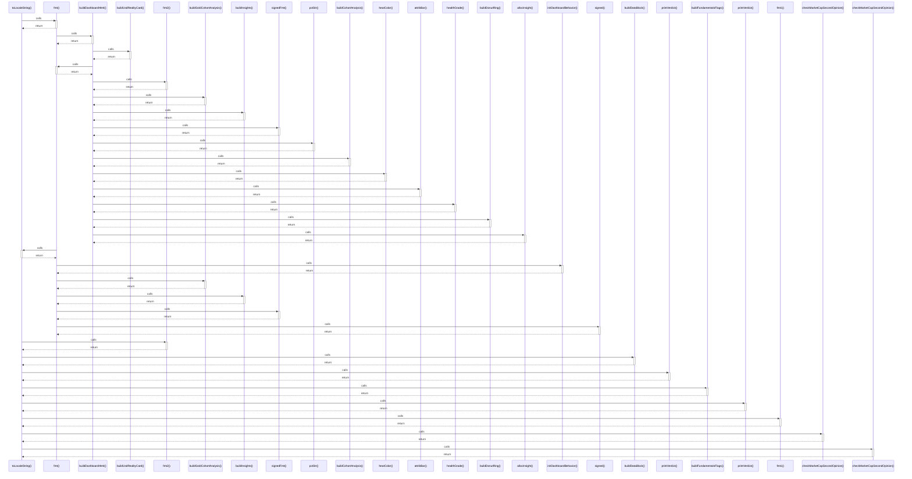

# toLocaleString()

> God node · 10 connections · [G:\AI\portofolio-dashbaord\artifacts\portfolio\src\components\AiBotWorkspace.tsx](file:///G:/AI/portofolio-dashbaord/artifacts/portfolio/src/components/AiBotWorkspace.tsx#L1761)

## Call Trace Diagram

## Connections by Relation

### calls
- [[fmt()]] `INFERRED`
- [[fmt2()]] `INFERRED`
- [[buildDataBlock()]] `INFERRED`
- [[printVerdict()]] `INFERRED`
- [[buildFundamentalsFlags()]] `INFERRED`
- [[printVerdict()]] `INFERRED`
- [[fmt1()]] `INFERRED`
- [[checkMarketCapSecondOpinion()]] `INFERRED`
- [[checkMarketCapSecondOpinion()]] `INFERRED`

### contains
- [[AiBotWorkspace.tsx]] `EXTRACTED`

---

*Part of the graphify knowledge wiki. See [[index]] to navigate.*