# tryPlainFetch()

> God node · 9 connections · [G:\AI\portofolio-dashbaord\artifacts\api-server\src\scraper\parseStock.ts](file:///G:/AI/portofolio-dashbaord/artifacts/api-server/src/scraper/parseStock.ts#L334)

## Call Trace Diagram

```mermaid
sequenceDiagram
    participant P0 as tryPlainFetch()
    participant P1 as match
    participant P2 as fetchOverview()
    participant P3 as parsePlainNumber()
    participant P4 as extractLabeled()
    participant P5 as parseStockAnalysis()
    participant P6 as extractChartReferencePrice()
    participant P7 as parseSuffixedNumber()
    participant P8 as extractPercentageAfter()
    participant P9 as extractLabeledAny()
    participant P10 as parseWeek52Range()
    participant P11 as parsePercent()
    participant P12 as percentageChange()
    participant P13 as extractPeRatio()
    participant P14 as tryPlainFetch()
    participant P15 as tryPlainFetch()
    participant P16 as tryOptimizedBrowser()
    participant P17 as tryOptimizedBrowser()
    participant P18 as tryOptimizedBrowser()
    participant P19 as extractSignal()
    participant P20 as extractPeRatio()
    participant P21 as extractDividendYield()
    participant P22 as extractMarketCap()
    participant P23 as extractSectorRank()
    participant P24 as extractSignal()
    participant P25 as extractPeRatio()
    participant P26 as extractDividendYield()
    participant P27 as extractMarketCap()
    participant P28 as extractSectorRank()
    participant P29 as extractSignal()
    participant P30 as extractPeRatio()
    participant P31 as extractDividendYield()
    participant P32 as extractMarketCap()
    participant P33 as extractSectorRank()
    participant P34 as extractPercentNear()
    participant P35 as extractCagr()
    participant P36 as extractPriceNear()
    participant P37 as extractScoreNear()
    participant P38 as extractPointsNear()
    participant P39 as extractChangePercentNear()
    participant P40 as extractYtdPercentNear()
    participant P41 as extract1yPercentNear()
    participant P42 as extractPercentNear()
    participant P43 as extractCagr()
    participant P44 as extractPriceNear()
    participant P45 as extractScoreNear()
    participant P46 as extractPercentNear()
    participant P47 as extractCagr()
    participant P48 as extractPriceNear()
    participant P49 as extractScoreNear()
    participant P50 as extractPointsNear()
    participant P51 as extractChangePercentNear()
    participant P52 as extractPointsNear()
    participant P53 as extractChangePercentNear()
    participant P54 as importedUnitsFromMeta()
    participant P55 as fetchSixtySessionMove()
    participant P56 as parseStockPage()
    participant P57 as emptySnapshot()
    P0->>+ P1: calls
    P1-->>- P0: return
    P1->>+ P2: calls
    P2-->>- P1: return
    P2->>+ P1: calls
    P1-->>- P2: return
    P2->>+ P3: calls
    P3-->>- P2: return
    P2->>+ P4: calls
    P4-->>- P2: return
    P2->>+ P5: calls
    P5-->>- P2: return
    P2->>+ P6: calls
    P6-->>- P2: return
    P2->>+ P7: calls
    P7-->>- P2: return
    P2->>+ P8: calls
    P8-->>- P2: return
    P2->>+ P9: calls
    P9-->>- P2: return
    P2->>+ P10: calls
    P10-->>- P2: return
    P2->>+ P11: calls
    P11-->>- P2: return
    P2->>+ P12: calls
    P12-->>- P2: return
    P2->>+ P13: calls
    P13-->>- P2: return
    P1->>+ P0: calls
    P0-->>- P1: return
    P1->>+ P14: calls
    P14-->>- P1: return
    P1->>+ P15: calls
    P15-->>- P1: return
    P1->>+ P16: calls
    P16-->>- P1: return
    P1->>+ P17: calls
    P17-->>- P1: return
    P1->>+ P18: calls
    P18-->>- P1: return
    P1->>+ P4: calls
    P4-->>- P1: return
    P1->>+ P19: calls
    P19-->>- P1: return
    P1->>+ P20: calls
    P20-->>- P1: return
    P1->>+ P21: calls
    P21-->>- P1: return
    P1->>+ P22: calls
    P22-->>- P1: return
    P1->>+ P23: calls
    P23-->>- P1: return
    P1->>+ P6: calls
    P6-->>- P1: return
    P1->>+ P7: calls
    P7-->>- P1: return
    P1->>+ P8: calls
    P8-->>- P1: return
    P1->>+ P10: calls
    P10-->>- P1: return
    P1->>+ P24: calls
    P24-->>- P1: return
    P1->>+ P25: calls
    P25-->>- P1: return
    P1->>+ P26: calls
    P26-->>- P1: return
    P1->>+ P27: calls
    P27-->>- P1: return
    P1->>+ P28: calls
    P28-->>- P1: return
    P1->>+ P29: calls
    P29-->>- P1: return
    P1->>+ P30: calls
    P30-->>- P1: return
    P1->>+ P31: calls
    P31-->>- P1: return
    P1->>+ P32: calls
    P32-->>- P1: return
    P1->>+ P33: calls
    P33-->>- P1: return
    P1->>+ P34: calls
    P34-->>- P1: return
    P1->>+ P35: calls
    P35-->>- P1: return
    P1->>+ P36: calls
    P36-->>- P1: return
    P1->>+ P37: calls
    P37-->>- P1: return
    P1->>+ P38: calls
    P38-->>- P1: return
    P1->>+ P39: calls
    P39-->>- P1: return
    P1->>+ P40: calls
    P40-->>- P1: return
    P1->>+ P41: calls
    P41-->>- P1: return
    P1->>+ P13: calls
    P13-->>- P1: return
    P1->>+ P42: calls
    P42-->>- P1: return
    P1->>+ P43: calls
    P43-->>- P1: return
    P1->>+ P44: calls
    P44-->>- P1: return
    P1->>+ P45: calls
    P45-->>- P1: return
    P1->>+ P46: calls
    P46-->>- P1: return
    P1->>+ P47: calls
    P47-->>- P1: return
    P1->>+ P48: calls
    P48-->>- P1: return
    P1->>+ P49: calls
    P49-->>- P1: return
    P1->>+ P50: calls
    P50-->>- P1: return
    P1->>+ P51: calls
    P51-->>- P1: return
    P1->>+ P52: calls
    P52-->>- P1: return
    P1->>+ P53: calls
    P53-->>- P1: return
    P1->>+ P54: calls
    P54-->>- P1: return
    P1->>+ P55: calls
    P55-->>- P1: return
    P0->>+ P56: calls
    P56-->>- P0: return
    P0->>+ P19: calls
    P19-->>- P0: return
    P0->>+ P20: calls
    P20-->>- P0: return
    P0->>+ P21: calls
    P21-->>- P0: return
    P0->>+ P22: calls
    P22-->>- P0: return
    P0->>+ P23: calls
    P23-->>- P0: return
    P0->>+ P57: calls
    P57-->>- P0: return
```

## Connections by Relation

### calls
- [[match]] `INFERRED`
- [[parseStockPage()]] `EXTRACTED`
- [[extractSignal()]] `EXTRACTED`
- [[extractPeRatio()]] `EXTRACTED`
- [[extractDividendYield()]] `EXTRACTED`
- [[extractMarketCap()]] `EXTRACTED`
- [[extractSectorRank()]] `EXTRACTED`
- [[emptySnapshot()]] `EXTRACTED`

### contains
- [[parseStock.ts]] `EXTRACTED`

---

*Part of the graphify knowledge wiki. See [[index]] to navigate.*